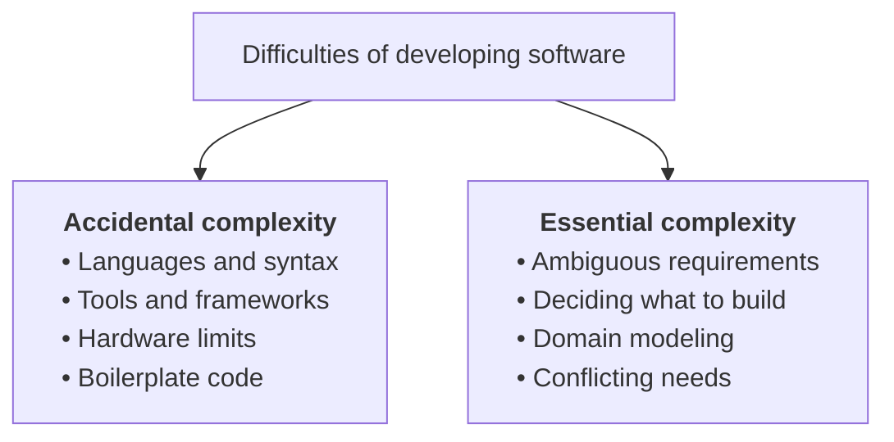

*Why are software developers always looking for the "perfect recipe"? A reflection on the use of AI, on the hatred of ambiguity, and on the true essence of software engineering.*

---

Every morning I wake up, and the first thing I do is open X and LinkedIn to catch up on the latest news from the tech and IT world.
These social networks have always been a source of inspiration and a place to discover the latest cutting-edge technology,
and over the course of my career they have let me stay up to date with how the industry evolves.
Obviously, with the AI explosion of the last few years, the focus is mostly on that topic.  
The interesting thing is that even if the overall topic is partly different from the one of previous years,
there's a common pattern that still holds in the vast majority of the posts I see on these social networks:
trying to sell the "ultimate solution", the "perfect recipe" for the problem of the day.

In practice, I've seen this movie before, more than once, during [my career](/blog/post/2026/07/18/memories-failures-18-years-software-engineer),
and even earlier, I'd say, at university.
Back in those years, I remember the endless battles over choosing among a multitude of languages, PHP and Java among them.  
I remember, during my first years of work in Milan when I started developing mobile applications,
the endless battles between "native only" and all the cross-platform development frameworks that followed one another over time (eventually leading to React Native and Flutter).
The last few years haven't been any different, from the push for "everything must be a microservice" to "everything must live in the cloud", and many more,
but in general there has always been someone pushing in the direction of "we have to do \<new tech/solution available\> because it's the ultimate recipe for all our problems".  
I've seen the same flawed reasoning on the development practices side too: who among you has never argued about topics related to agile practices?
How many consulting firms have we seen over the years offering "the ultimate recipe to make your development processes lean and adapt to market changes at 'the speed of light'"?  
And now history is repeating itself once again: every day on social networks I find someone writing, full of conviction, that they've found the ultimate recipe to launch countless agents to develop software,
the ultimate skills that mean you won't need anything else, and general plugins and solutions that fit everyone to automate development processes.
But how many of these solutions are really 100% valid for everyone?

I'm convinced that everything I described above is an intrinsic consequence of the nature of the computer science field, and therefore of the people who are part of it, software developers in particular.
We have always been inclined to abstract.
We are so convinced of it that it has even become one of the cornerstone principles of programming: [DRY (Don't Repeat Yourself)](https://en.wikipedia.org/wiki/Don%27t_repeat_yourself).
When we write code (and these days, when AI writes it for us :sweat_smile:), this becomes one of our superpowers, letting us write software that is easy to maintain and reusable over time.  
But it has also become our obsession as software developers, bordering on pathology: we want to abstract everything, even outside of programming.
We want to generalize everything, processes and people included. The cause lies in our hatred of ambiguity.

So why do we software developers chase standardization so relentlessly?
Because software developers, more than anyone, need certainties, and more than many other groups they suffer from the [need for cognitive closure](http://www.communicationcache.com/uploads/1/0/8/8/10887248/individual_differences_in_need_for_cognitive_closure.pdf).
According to this principle from psychology, people tend to look for a certain and definitive answer to a question, a problem, or an ambiguous situation, running away from doubt.
People with this trait often show two characteristics:

> **Seizing:** we accept, as soon as possible, the first answer to the problem or doubt we are facing.
>
> **Freezing:** we stay "frozen", as the term itself says, in the choice we made.

Our obsession with generalization is so deeply rooted that over time it has generated research and academic papers on the subject.
In particular, I'd like to focus on ["No Silver Bullet: Essence and Accidents of Software Engineering"](https://www.cs.unc.edu/techreports/86-020.pdf) by Fred Brooks,
which I also saw cited in a [blog post](https://cekrem.github.io/posts/there-is-still-no-silver-bullet/) I recently stumbled upon.  
Brooks opens the essay by comparing software projects to werewolves.
Just as ordinary people can turn into terrifying monsters, software projects follow the same pattern: missed deadlines, missing features, bugs, and blown budgets.
Hence Brooks' thesis: many people look for the "silver bullet" for software projects, but it doesn't exist.

Brooks starts by describing the difficulties of developing software [using Aristotelian philosophy](https://plato.stanford.edu/entries/essential-accidental/), and splits them into two broad categories:

- **accidental complexity:** given by the way (the tools, and the intrinsic limits they carry with them) we translate a vision or a product into software. These tools and limits are tightly coupled to the technology available at a given moment in history.
- **essential complexity:** given by the very nature of the activity of creating software. Resolving the ambiguities in the requirements, understanding and defining what we want to create, and modeling that vision into a well-defined domain.

The key point of the paper is a topic I often discuss with several colleagues: **the hard part of software development is tied to essential complexity**.
The incredible thing about that paper (also mentioned in the blog post I linked above) is that 40 years ago
(fun fact: the paper was released in the month and year I was born :laughing:) Brooks also talks about AI, using a term I often hear on social networks from various tech influencers: *automatic programming*.  
And it's true: by now it's undeniable that LLMs have practically wiped out the accidental complexity of software development.
Despite how general they are when it comes to writing code, have they also wiped out essential complexity?
Don't get me wrong, I know well that, as things stand today, LLMs can help you reason about a very wide set of problems.
But are they really the "silver bullet" of software development? Or have we once again raised the level of abstraction at which we write software?

The answer is in front of me every day. At the company where I work we make massive use of these tools, and we have sped up many of our activities incredibly.
But in practice, still today and despite everything, I often find myself facing problems where there is no general answer or an algorithm for everything:
to this day, solving a given problem or developing a new feature requires solutions that depend heavily on what you're doing.  
Without going into details, even the way LLMs are used for development changes radically across different teams and areas, and sometimes even within the same team.
This is because, still today, the product an area works on, and the people who work on it, have different needs dictated by the product itself or by the nature of the people,
and they require an approach whose answer is **it depends**.  

Despite being in love, as a software developer, with the "perfect recipe" that solves everything, I realize that I change my approach based on the situation.
And lately I've noticed it even more in the way I use AI for development.
Recently, in fact, I've worked a lot on this blog and on a series of open source projects connected to it, exploiting the possibilities of AI to the fullest.
I find myself in a real Mr. Hyde and Dr. Jekyll situation:

- **at night I'm Mr. Hyde**, when I work on my blog: following the "I delegate everything to AI" recipe, in some sessions I get to the edge of vibe coding,
  delegating to agents and reviewing PRs only quickly and at a very high level.
  This has let me reach a complexity and a richness of features in the project that I could never have reached until a couple of years ago (alone, in my spare time).
  Now the project is a [monorepo](/blog/post/2026/09/11/monorepo-npm-workspaces-turborepo-nextjs-blog), with several packages inside it (some of them published on npm)
  and an ecosystem that makes it my [software experimentation lab](https://labs.fabrizioduroni.it).
  Why can I afford all this speed and richness of features? Because it's a project where I act as a "dictator",
  with very strong guardrails (gates) that I put in place while developing the project: on the application's architecture,
  on conventions, enforced both through linting and through rules of engagement for the agents
  (even if sometimes I almost go full vibe coding, [I have a well-defined SDLC that specifies the whole development workflow](https://labs.fabrizioduroni.it/lab/chicio-labs-sdlc/), guardrails included),
  and on testing, using tools that let the agents get real feedback on how the applications work.

- **by day, instead, I'm Dr. Jekyll**, when I work on software for [lastminute.com](https://corporate.lastminute.com).
  Here, every day, I have to deal with an environment made of several areas each specialized in a domain, different teams, new vs legacy systems,
  business requirements that aren't always clear, and iterations to adapt to market needs.
  The result is an intrinsic complexity of the system that is inextricably bound up with human chaos: clashes of opinions, disagreement on various topics and approaches,
  different ideas that try to solve the same problem, which usually lead to the creation of software that is a mix of all these different dynamics.
  This also means not blindly delegating everything to AI (even though some projects contain the guardrails I mentioned before),
  and still applying in-depth system design, meticulous code reviews when needed, and staying in control of every implementation detail of the system.
  This implies an approach closer to what has lately been called [spec-driven development](https://github.blog/ai-and-ml/generative-ai/spec-driven-development-with-ai-get-started-with-a-new-open-source-toolkit/),
  where a very high level of detail on the implementation side can help produce systems that are more maintainable
  (for both people and AI agents, but maybe we'll dig into that in another post) and scalable.

If I had to act like the software developer I am, what should I try to do with the two approaches above?
What's the right way, or the "standardization", in my way of working? **The right answer is, most likely, both.
The deciding factor isn't the technology, but the context, and the essential complexity of the systems you work on**.
Nothing prevents the first approach from working for the second case in certain situations,
while, the other way around, I've already had the chance to try the second one on the first (especially in the early phases of setting up AI for the project).

Obviously, both approaches above are possible in my case because I've been writing software [for almost 20 years now](/blog/post/2026/07/18/memories-failures-18-years-software-engineer).
How does all of this fit, instead, with the generation of future software developers coming out of universities right now?
Unfortunately I don't have the answer, and maybe we'll talk about it properly in another post.

So why does AI seem to have made software developers' need for cognitive closure worse?
AI has exponentially amplified this trait in software developers, because of the disruption it brought to the way of working we had been used to for the last 30 years.  
I realize I suffer from it myself: I went from [snubbing the topic to becoming a fan and enthusiast](/blog/post/2026/07/18/memories-failures-18-years-software-engineer),
and more than once I've told myself "ok, I've found the ultimate way to use AI/LLMs", only to discover two weeks later that some "new stuff" had invalidated my assumptions.  

Over the last few months all of this has been leading me to rethink my beliefs and the way I act.
I've noticed that, while I used to dig in on certain positions of mine, I've learned to reassess my own knowledge of every topic, every day.
By now I'm wary of anyone who offers me "ultimate recipes", because, [as I already said](/blog/post/2026/07/18/memories-failures-18-years-software-engineer),
they rarely exist, and they usually only apply well under certain conditions.

What does this lead me to say? Am I perhaps trying to tell you what the final recipe for facing uncertainty in the age of AI is,
falling back into the very situation I (think I) have finally gotten out of?
No, I'm just trying to tell you that everything changes, more than ever in the world of computer science,
and given the impact that AI and LLMs are having, we'll probably see the effects in every line of work over time.

There's only one thing we can do: adapt. And in this too, software developers have already shown in the past that they can do it better than others.
We need someone able to bring order to the chaos of ideas, incomplete roadmaps, broken prototypes, and unclear business requirements.
We need someone who takes responsibility for the software product and who is able, once again, to deliver the best possible experience to customers.

The job of the past, present, and future isn't mapping code, it's mapping human chaos.
