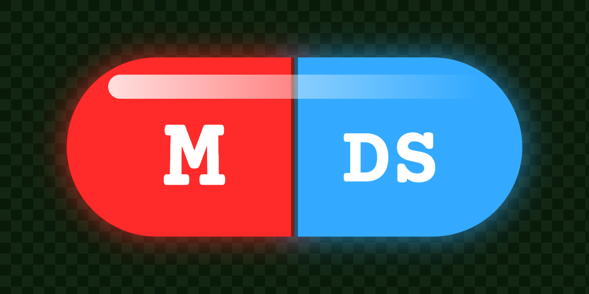

# matrix-design-system

A Matrix-inspired React design system: green on near-black, Open Sans for prose, Courier Prime for
anything terminal-flavoured. Every component here is a real component from
[fabrizioduroni.it](https://www.fabrizioduroni.it).

## Install

```bash
npm install matrix-design-system
```

`react`, `react-dom` and `framer-motion` are peer dependencies — `framer-motion` because its
`AnimatePresence` context has to be shared with your own animated components, which a second copy
would break.

Everything in the root barrel works with just those installed. Three groups need heavier libraries,
so they live behind their own entry points and you install a peer only if you import one:

| Import from                            | Install                                                | For                                                     |
| -------------------------------------- | ------------------------------------------------------ | ------------------------------------------------------- |
| `matrix-design-system/chart`           | `recharts`                                             | `ChartPanel`, `ChartTooltip`, `DonutChart`              |
| `matrix-design-system/markdown`        | `react-markdown`, `unified`, the remark/rehype plugins | `Markdown`                                              |
| `matrix-design-system/command-palette` | `cmdk`                                                 | `CommandPalette`, its items and `CommandPaletteTrigger` |

Nothing else is optional: the rain effect is part of the design system's identity — `BrandHeader`
and the matrix backgrounds all render it — so `matrix-rain-webgpu` is a plain dependency and comes
along automatically.

## Use

```tsx
import { Accordion, Chip, SectionHeading, StatCard } from "matrix-design-system";
import { DonutChart } from "matrix-design-system/chart";
import "matrix-design-system/styles.css";
```

The stylesheet must be imported after Tailwind:

```css
@import "tailwindcss";
@import "matrix-design-system/styles.css";
```

**The page surface must be dark.** The stylesheet sets `html body` to `#001100` on `#E8FFE8`; most
components are near-invisible on white.

## Styling

Style your own layout with Tailwind utilities — they resolve against this theme, so use its names
rather than stock Tailwind colours:

| Family   | Names                                                                        |
| -------- | ---------------------------------------------------------------------------- |
| Brand    | `primary` (#00FF41), `primary-dark`, `secondary`, `accent` (#39FF14)         |
| Surfaces | `general-background` (#001100), `general-background-light`, `black`, `white` |
| Text     | `primary-text` (#E8FFE8), `secondary-text`, `text-above-primary`             |
| Fonts    | `font-sans` → Open Sans · `font-mono` → Courier Prime                        |

**The breakpoint scale is overridden**: `xs` 576 · `sm` 768 · `md` 992 · `lg` 1200 · `xl` 1600 ·
`2xl` 2000 (px). So `md:` starts at 992px, not 768px — the most common way a layout built with this
theme behaves differently from expected.

Composed classes worth reaching for: `.glassmorphism` (and `-lite`, `-no-scale`), `.glow-border`,
`.glow-container`, `.pill`, `.call-to-action`, `.container-fixed`.

Fonts are not bundled: load Open Sans and Courier Prime yourself.

## Host Identity

The name a host presents itself with is never defaulted: `BrandHeader` requires `title`, `tagline` and
`logoAlt`, `Footer` requires a `signature`. The social
contacts of the footer are optional, platform by platform
([ADR-0003](docs/adr/0003-host-identity-has-no-default.md)).

## Framework-agnostic by design

The package imports nothing from any framework. Where a component needs framework behaviour it takes
it as a prop, with a working default:

```tsx
import NextLink from "next/link";
import NextImage from "next/image";

<InternalLink to="/blog" linkComponent={NextLink}>Blog</InternalLink>
<ImageGlow src={photo} alt="" imageComponent={NextImage} />
<Menu currentPath={usePathname()} entries={entries} linkComponent={NextLink} />
```

Without them you get a real `<a>` and a real `` — `PlainImage` reproduces `next/image`'s
`fill`, placeholder and lazy-loading behaviour — so the components work anywhere, just without
client-side routing or image optimisation.

## Navigation is injected

`Menu` and `Footer` know nothing about your site: you hand them the navigation.

```tsx
const entries: MenuEntry[] = [
    { label: "Home", to: "/" },
    {
        label: "Blog",
        groups: [
            { label: "Posts", items: [{ label: "Latest posts", to: "/blog", onClick: trackBlog }] },
            { label: "Elsewhere", items: [{ label: "Docs", to: "https://example.com", external: true }] },
        ],
    },
];

<Menu
    currentPath={pathname}
    entries={entries}
    pinnedOnPaths={["/chat"]}
    linkComponent={NextLink}
    trailing={<CommandPaletteTrigger />}
/>
<Footer
    signature="Made by Jane"
    links={[{ label: "Home", to: "/" }]}
    contactHref="/contact"
    socialLinks={social}
/>
```

An entry is either a link (`MenuLink`) or a dropdown of grouped links (`MenuDropdown`, told apart by its
`groups`). A link is marked selected when its `to` equals `currentPath`, or when `currentPath` starts with one of
its optional `activePathPrefixes` (for a detail route that lives outside the link's own path, e.g. an "Authors"
link to `/blog/authors` with `activePathPrefixes: ["/blog/author/"]`); external links never are, and a dropdown
holding a selected link is highlighted too. A link's
`onClick` is where tracking goes, and the mobile panel closes on click by itself. The menu hides on scroll
except on `pinnedOnPaths`.

The end of the bar is a `trailing` slot: pass `<CommandPaletteTrigger />` (from `matrix-design-system/command-palette`,
with an optional `label` and an `onTrigger` callback for tracking) to get the search button and its shortcut hint, or
nothing for a host without a palette.

### Migrating from 2.x

- `BrandHeader`: `title`, `tagline` and `logoAlt` are now required; the header no longer assumes any Host Identity.
  Pass `title="CHICIO CODING" tagline="Pixels. Code. Unplugged." logoAlt="blog logo"` to keep 2.x's text.
- `Footer`: `author` is gone and `signature` (a `ReactNode`) is required. Pass
  ``signature={`> Made with 💝 by ${author} 'Chicio'`}`` to keep 2.x's line. `socialLinks` and `contactHref` are now
  optional, and `FooterLink` accepts `external`.
- `SocialContacts`: every platform and `contactHref` are optional; only the ones given are rendered.
- `Menu`: 2.x always rendered the search button, and `onPaletteTrigger` is gone. Pass
  `trailing={<CommandPaletteTrigger onTrigger={onPaletteTrigger} />}` to keep it, or nothing to drop it.
- The type `CommandPaletteTrigger` is now `CommandPaletteChangeCause`; the name belongs to the new component.

### Migrating from 1.x

- `Menu`: `navHrefs` and `tracking` are gone. Build a `MenuEntry[]` (labels and hrefs included) and pass it as
  `entries`; each former `onTrack*` callback becomes the `onClick` of its link. The chat path that used to be
  hardcoded is now `pinnedOnPaths={[chatPath]}`. The Authors link that used to stay selected on author pages is
  now `{ label: "Authors", to: "/blog/authors", activePathPrefixes: ["/blog/author/"] }`.
- `Footer`: `navHrefs` and `navTracking` are gone. Pass `links` (`{ label, to, onClick? }`, Home included) and
  `contactHref`. `socialTracking` is unchanged.
- The exported types `MenuNavHrefs`, `MenuTrackingCallbacks`, `FooterNavHrefs` and `FooterNavTrackingCallbacks`
  are removed; `MenuEntry`, `MenuLink`, `MenuGroup`, `MenuDropdown` and `FooterLink` replace them.

## Collection components

Four molecules cover the pages of a collection (a list of cards, a detail page, a filtered list):

```tsx
<CoverCard
    src="/covers/death-note.jpg"
    title="Death Note"
    action={{ kind: "link", href: "/manga/death-note", onClick: trackOpen }}
    badges={<CoverCardBadge>1/1 ✓</CoverCardBadge>}
    imageComponent={NextImage}
    linkComponent={NextLink}
/>
<CoverCard src="/art/jellyfish.jpg" title="Jellyfish" action={{ kind: "lightbox" }} />

<InfoPill icon={<IoCalendarOutline />} label="Acquired" value="2026" />
<PreviousNextNavigation
    previous={{ url: "/manga/death-note", title: "Death Note" }}
    next={{ url: "/manga/one-piece", title: "One Piece" }}
    linkComponent={NextLink}
/>
<EmptyState icon={<IoBookOutline />} subject="manga" query={query} />
```

- `CoverCard`: a fixed-height card showing the cover over a blurred copy of itself, with a glass caption
  (`title`, also the image alt) and a top-right `badges` slot. `action` is either a link
  (`{ kind: "link", href, onClick? }`, rendered through `linkComponent`) or `{ kind: "lightbox" }`, which
  opens the cover in the lightbox (mount `Lightbox` once in the page). The cover mounts only when the card
  comes within 600px of the viewport, so a grid of hundreds stays cheap. `CoverCardBadge` is the badge
  styling.
- `InfoPill`: `icon`, `label` and `value`; lay a wrapping row of them out yourself.
- `PreviousNextNavigation`: a blue pill for `previous`, a red pill for `next`; either side is optional.
- `EmptyState`: `icon` above "No `subject` found for “`query`”."

## No provider required

There is no theme or context provider to wrap anything in. Components read their styling from CSS
custom properties, and the two global preferences (motion, glassmorphism variant) come from
`localStorage` with sensible defaults.

## License

MIT © Fabrizio Duroni

## Claude Design sync

`.design-sync/` and `.ds-sync/` in this folder are the [claude.ai/design](https://claude.ai/design)
converter. It reads the Storybook stories beside each component — there are no hand-authored
previews, so a story is the only place a component's example lives.

**Run `/design-sync` from a session rooted at this package, not at the repository root.** Every path
the converter uses is resolved from its working directory and it does no upward search, so a
root-level run fails with `[CONFIG] … ENOENT`. Rooting the session here also keeps the skill
consistent with itself, since it stages `.ds-sync/` relative to the session root.

The two folders must stay siblings: the fork in `.design-sync/overrides/` imports `../.ds-sync/lib/`,
and `.design-sync/node_modules` symlinks to `../.ds-sync/node_modules`.

`.design-sync/NOTES.md` has the full invocation and the re-sync watch-list.
